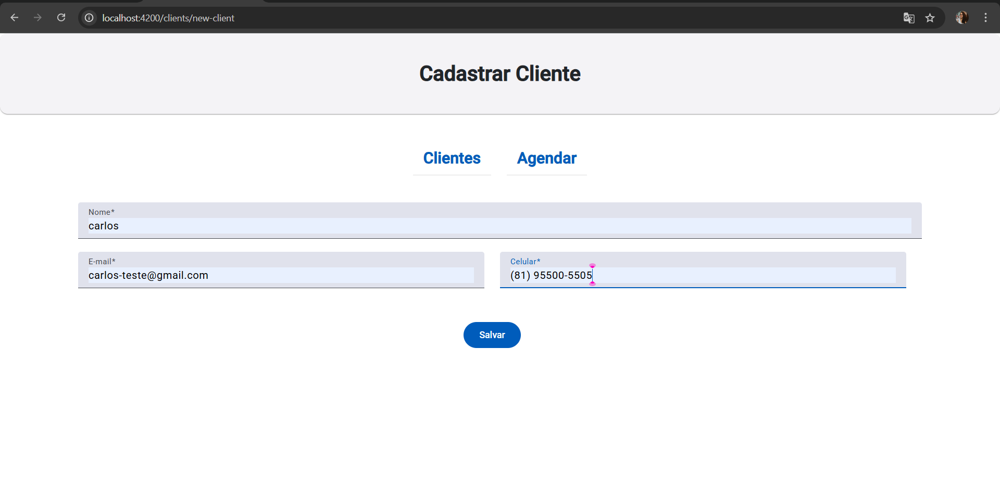
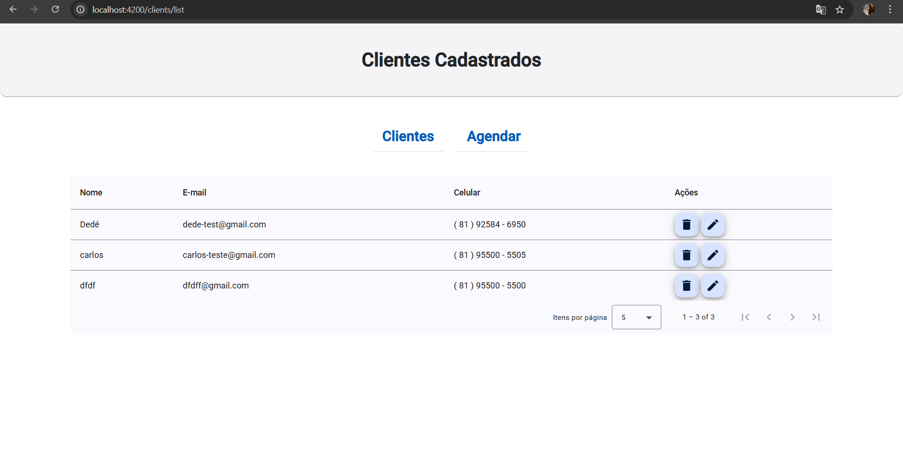
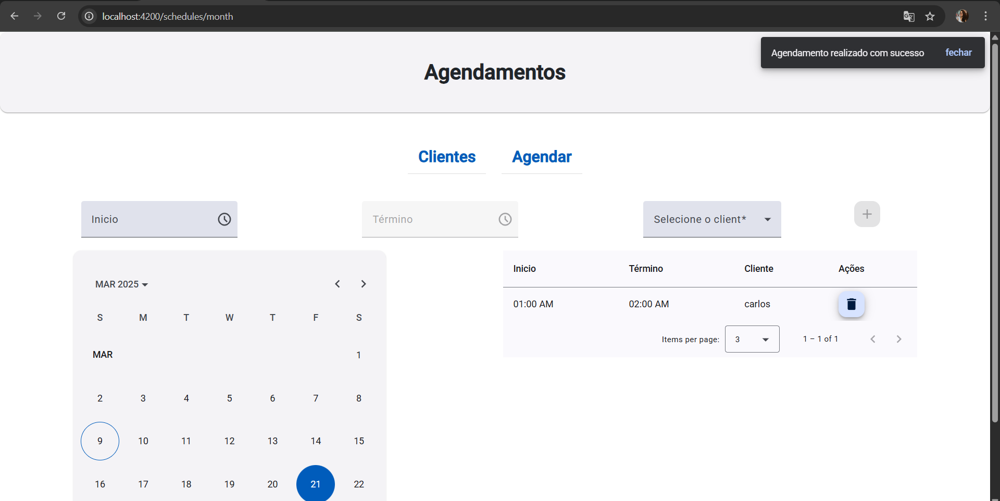
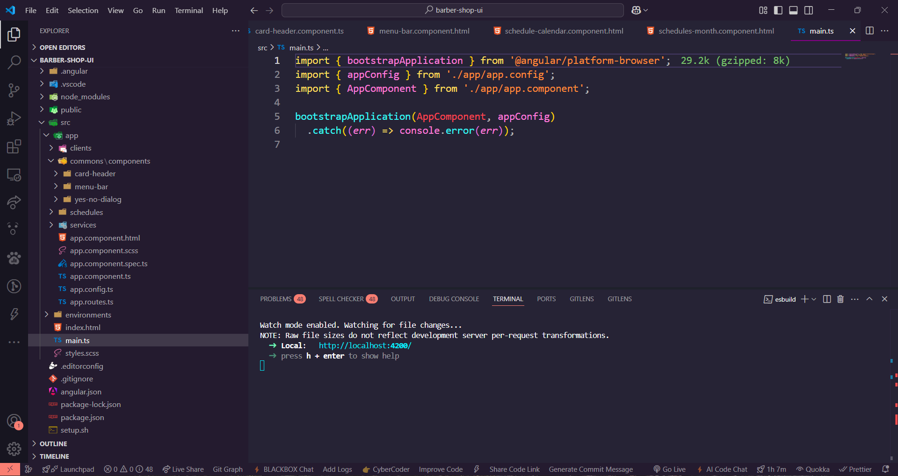

# Barber-Shop-UI

Este é um projeto **fullstack** chamado **Barber-Shop-UI**, desenvolvido no **VSCode** com o framework **Angular** e **TypeScript**. O objetivo do projeto é criar um sistema de agendamento de clientes para uma barbearia, com funcionalidades de cadastro de clientes, listagem de cadastros e agendamento de clientes.

## 🚀 Tecnologias Utilizadas

  
  
  
  
  

  ## 🎯 Funcionalidades

✔️ Cadastro de clientes  
✔️ Listagem de clientes cadastrados  
✔️ Agendamento de horários  
✔️ Interface responsiva  
✔️ Diálogos de confirmação

## 🛠 Estrutura do Projeto

Abaixo está a organização dos principais componentes e serviços do projeto:

### **Clientes**
- **new-client**: Tela para cadastro de um novo cliente.
- **list-clients**: Tela para exibição da listagem de clientes cadastrados.
- **edit-client**: Tela para edição dos dados de um cliente.
- **components/client-form**: Componente para o formulário de cadastro de cliente.
- **components/client-table**: Componente para exibição dos clientes em uma tabela.
- **client.models.ts**: Arquivo com os modelos de dados relacionados aos clientes.

### **Agendamentos**
- **schedules-month**: Componente para exibição do calendário de agendamentos.
- **components/schedule-calendar**: Componente para interação com o calendário de agendamentos.
- **schedule.models.ts**: Arquivo com os modelos de dados relacionados aos agendamentos.

### **Componentes Comuns**
- **components/card-header**: Componente de cabeçalho para cards.
- **components/menu-bar**: Componente para a barra de navegação.
- **components/yes-no-dialog**: Componente de diálogo de confirmação (sim ou não).

### **Serviços**
- **dialog-manager**: Serviço para gerenciamento de diálogos.
- **snackbar-manager**: Serviço para gerenciamento de alertas (snackbars).
- **api-client/clients**: Serviço para interagir com a API dos clientes.
  - **iclients.service.ts**: Interface para os serviços de clientes.
  - **client.models.ts**: Modelos de dados dos clientes.
- **api-client/schedules**: Serviço para interagir com a API de agendamentos.
  - **schedules.service.ts**: Serviço para os agendamentos.
  - **schedule.models.ts**: Modelos de dados dos agendamentos.
- **service.token.ts**: Arquivo de gerenciamento de tokens de autenticação.

## 📦 Dependências

- **@angular/cdk**: Biblioteca para componentes avançados, como drag-and-drop, overlays, etc.
- **bootstrap**: Framework CSS para construção de interfaces responsivas.
- **ngx-mask**: Biblioteca para a aplicação de máscaras de entrada (como CPF, CNPJ, etc.).

## ✨ Considerações Finais

Este foi meu **primeiro desafio fullstack**, e a experiência foi muito desafiadora. Conseguir reproduzir o projeto conforme as aulas, mesmo sem muitas melhorias, foi uma conquista válida e um aprendizado essencial para o desenvolvimento de aplicações fullstack.

📢 Este projeto foi desenvolvido para fins acadêmicos.

## 🖼 Imagens do Projeto

*Tela inicial do projeto*

*Tela de listagem de clientes*

*Tela de Agendamento*

*Projeto rodando no VSCode*

